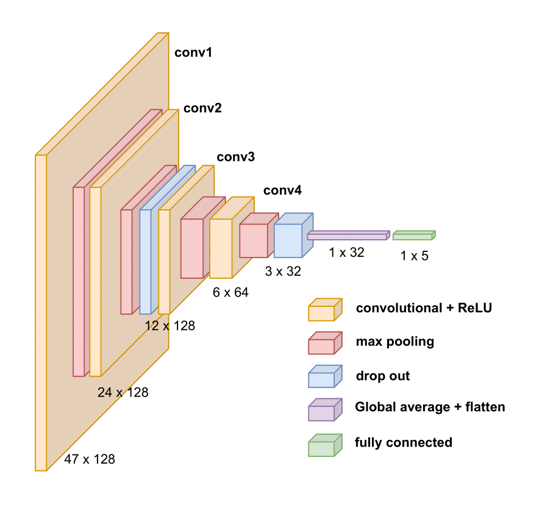

# EdgeHeart: Deep Learning Based Classification of Conduction Disorders in heart

By [Sudhanshu Gaurhar[1]&#42;](https://www.linkedin.com/in/salim-rukhsar-10845282/),
[Salim Rukhsar[1]&#42;](https://www.linkedin.com/in/sudhanshu-gaurhar-20253273/),
[Anil K. Tiwari[1]&#42;](http://home.iitj.ac.in/~akt/),
[Tushar S. Shinde[2]&#42;](https://www.linkedin.com/in/tushar-shinde-phd/),

In association with Image Processing and Computer Vision Lab @ Indian Institute of Technology jodhpur[1] and Indian Institute of Technology Madras Zanzibar [2].

ABSTRACT: Cost-effective, lightweight, or compressed deep learning algorithms are the need in the field of cardiac health, as they can be deployed on portable, resource-constrained hardware to assess cardiac health in real time. This paper presents a lightweight 1-D convolutional neural network based model to identify five distinct arrhythmias in accordance with the AAMI EC57 standard. The method is specifically compressed for deployment on resource-constrained devices. This advancement is pivotal for integrating sophisticated cardiac monitoring into everyday use. Our compressed deep learning architecture is evaluated on the PhysionNet MIT-BIH dataset, demonstrating an average classification accuracy of 91.41\%. Furthermore, the proposed approach achieves a notable 60\% reduction in model size compared to current state-of-the-art methods. This reduction is essential for resource-constrained devices, ensuring efficient, real-time monitoring, and timely intervention in cardiac health management. 
## Usage

The preprocessed PhysionNet MIT-BIH dataset can be downloaded from [MIT-BIH](https://www.kaggle.com/datasets/shayanfazeli/heartbeat), Subsequently, place it on google drive of training and testing datset.

Once the data is prepared, the code is compatible for direct execution with Torch version==2.1.2.
## Final Words
We aim to maintain this repository with regular updates, aspiring for its relevance and practicality in supporting your research endeavors. 
